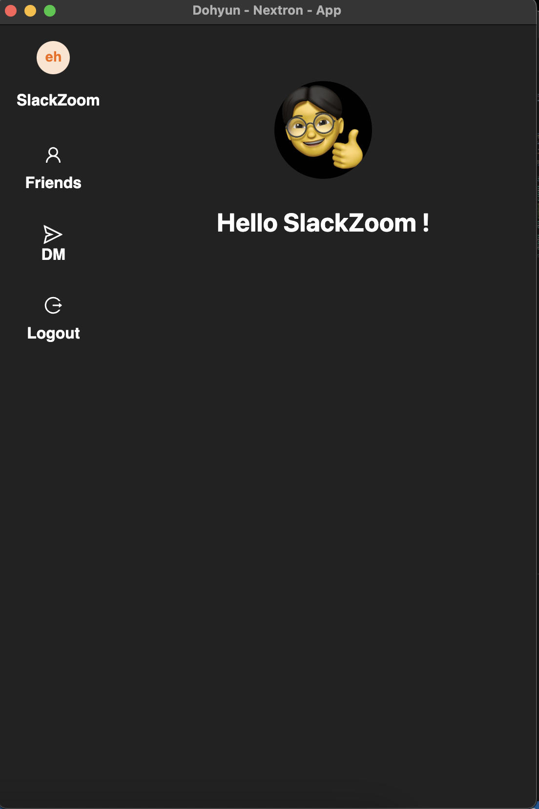
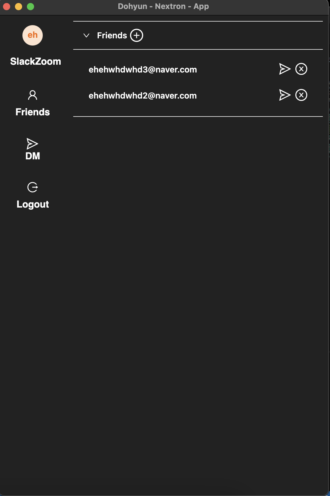
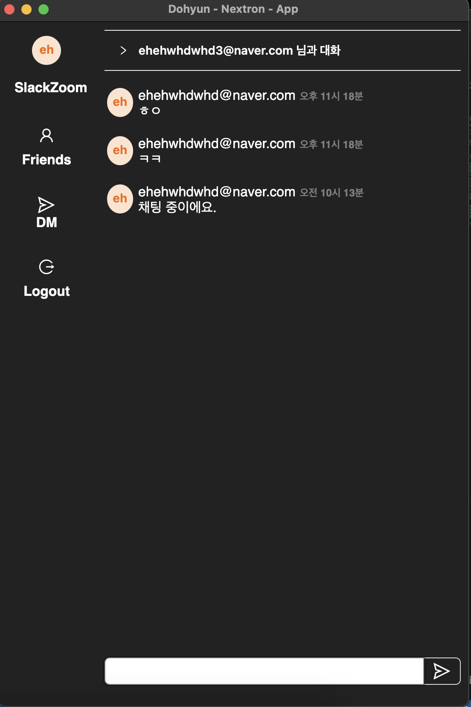

### Info

<br/>

<br/>


### Install Dependencies

```
$ yarn
```

### firebase Page

<a href='https://console.firebase.google.com' rel='noopener' rel='noreferrer' target='_black'>=> Firebase</a>

### firebase config => root/renderer/.env

```
# firebase
NEXT_PUBLIC_ENV_FIREBASE_APP_KEY=
NEXT_PUBLIC_ENV_FIREBASE_AUTH_DOMAIN=
NEXT_PUBLIC_ENV_FIREBASE_PROJECT_ID=
NEXT_PUBLIC_ENV_FIREBASE_STORAGE_BUCKET=
NEXT_PUBLIC_ENV_FIREBASE_MESSAGING_SENDER_ID=
NEXT_PUBLIC_ENV_FIREBASE_APP_ID=
```

### Use it

```
#install
$ yarn 

# development mode
$ yarn dev (or `npm run dev` or `pnpm run dev`)

# production build
$ yarn build (or `npm run build` or `pnpm run build`)
```

# sign up => login => chat !
